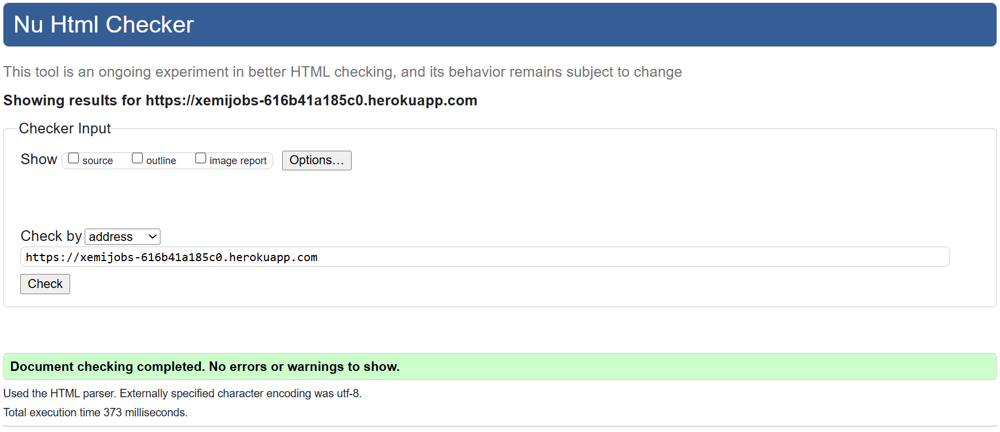
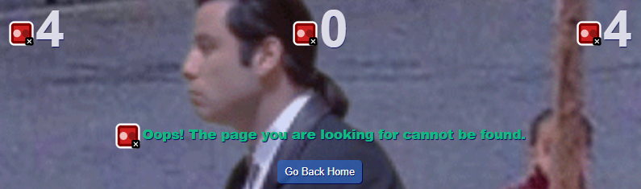
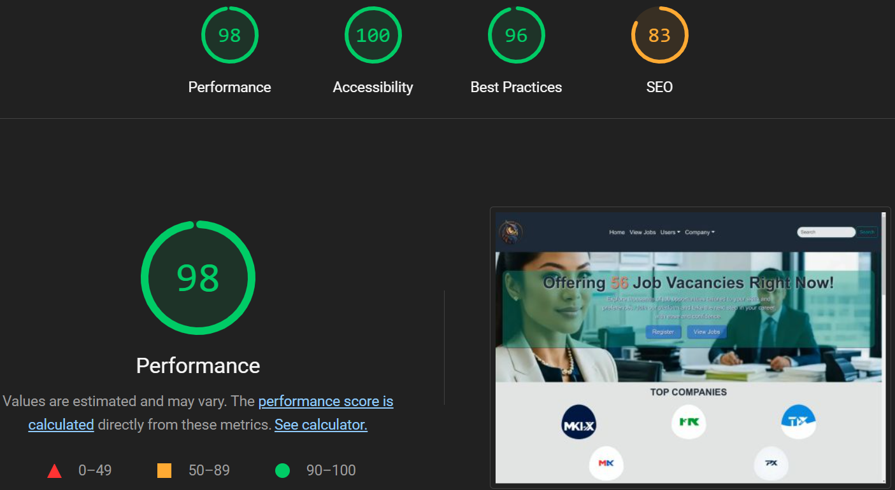

# Victor Garcia Cantalapidera 
-Slack:[@Victor Garcia](https://code-institute-room.slack.com/team/U0695HZA7FZ)

-GitHub: [Vgarcan](https://github.com/Vgarcan)

-LinkedIn: [Victor Garcia](https://www.linkedin.com/in/vgc89/)

## Check us out!

[XemiJobs - Heroku](https://xemijobs-616b41a185c0.herokuapp.com/) 

---

### Table of Contents

- [Introduction](#introduction)
- [Features](#features)
- [Development Tools](#development-tools)
- [Technologies Used](#technologies-used)
- [Project Structure](#project-structure)
  - [CSS Management for Project Structure](#css-management-for-project-structure)
- [Wireframes](#wireframes)
- [Colors](#colors)
  - [Color Customization Process](#color-customization-process)
  - [User-Friendly Approach](#user-friendly-approach)
- [User Experience](#user-experience)
  - [Key Principles](#key-principles)
  - [User Stories](#user-stories)
  - [Customization and Flexibility](#customization-and-flexibility)
  - [Future Enhancements](#future-enhancements)
- [Testing](#testing)
  - [HTML Validation](#html-validation)
  - [CSS Validation](#css-validation)
  - [Accessibility](#accessibility)
  - [Wave Validation](#wave-validation)
  - [Lighthouse Validation](#lighthouse-validation)
  - [JSHint Validation](#jshint-validation)
  - [Device Testing](#device-testing)
  - [Browser Compatibility](#browser-compatibility)
  - [User Stories Testing](#user-stories-testing)
- [Collaborative Efforts](#collaborative-efforts)
- [Current State and Future Plans](#current-state-and-future-plans)
  - [Current State](#current-state)
  - [Future Plans](#future-plans)
- [Deployment](#deployment)
- [License](#license)
- [Bugs and Challenges](#bugs-and-challenges)
- [Acknowledgement](#acknowledgement)

---

### Introduction

XemiJobs is a job search platform designed to connect employers with potential candidates. This project was born out of my frequent personal use of job search websites, which sparked the idea to create a platform that could facilitate the hiring process more efficiently. The website allows companies to post job vacancies and manage applications, while job seekers can browse listings, apply for jobs, and manage their applications—all from a desktop interface.

The concept for XemiJobs emerged from my own experiences and the desire to build something that could help others in similar situations. I saw this as a great opportunity to deepen my understanding of web development and to create a functional tool that serves a real purpose. The goal of this project is simple: to create a platform that bridges the gap between job seekers and employers, making it easier for them to connect and communicate.

I'm incredibly proud of how this project has developed and hope it can serve as a useful resource for anyone involved in the job search or hiring process.

---

### Features

- **User Registration and Authentication:** Secure registration and login for job seekers and employers, with role-based access control to ensure users see only what they need.
- **Job Listings Management:** Employers can create, update, and delete job listings. The listings are displayed dynamically on the platform, allowing job seekers to browse through the latest opportunities.
- **Application Management:** Job seekers can apply for jobs directly through the platform, track the status of their applications, and receive updates as they progress through the hiring process.
- **Dynamic Dashboard for Employers:** The company dashboard provides a real-time overview of key metrics, such as the number of job postings, applications received, and interviews scheduled, helping employers manage their recruitment process effectively.
- **Real-Time Job Count:** The platform features a hero section that displays the current number of job listings, updated in real-time, offering users an up-to-date view of available opportunities.
- **Advanced Search and Filters:** Job seekers can search for positions based on various criteria like job title, location, and company, with results being dynamically updated.

---

### Development Tools

- **Custom Jinja Widgets:** A collection of reusable Jinja widgets has been created to streamline the development process. These widgets automatically adapt to the type of data being passed, ensuring a consistent aesthetic across the entire platform. This approach not only speeds up development but also maintains a high level of visual and functional uniformity throughout the site.
- **Modular Design:** The platform is built using a modular architecture in Flask, which allows for easy extension and maintenance. Each module is self-contained, facilitating rapid development and testing of individual components without affecting the entire application.
- **Consistent Aesthetic:** By leveraging these custom widgets, the design remains consistent, providing a unified look and feel across all pages and components, which enhances the overall user experience.

---

### Technologies Used

#### Backend
-  **Flask:** The core framework for the backend of the application, used for handling routing, sessions, and integrating with the database.
-  **Flask-Login:** Employed to manage user sessions and authentication, ensuring secure access control throughout the platform.
-  **Flask-PyMongo:** Utilized for integrating Flask with MongoDB, facilitating database operations directly from the Flask application.

#### Database
-  **MongoDB:** The primary database used to store user data, job listings, and application details, chosen for its flexibility and scalability.

#### Frontend
-  **HTML:** The foundation for structuring the web pages, providing the semantic markup needed for the site's content.
-  **CSS:** Applied to style and layout the web pages, ensuring a consistent and visually appealing user interface across the application.
-  **JavaScript:** Employed to add interactivity and dynamic elements to the site, enhancing the user experience with features like form validation and asynchronous content updates.
-  **Bootstrap:** Integrated to utilize its responsive grid system and pre-built components, ensuring the site is mobile-friendly and adaptable to different screen sizes.

---

### Project Structure

-  **Root Directory**
    
    -  **xemijobs/** (Main application folder)

        -  `__init__.py` (Initializes the application)
        -  `extensions.py` (Handles extensions and configurations)
        -  `decorators.py` (Custom decorators for the application)
        
        -  **static/** (Static assets like images, CSS, and JS files)
            -  **css/** (Contains CSS stylesheets)
                -  `main.css` (Main stylesheet)
            -  **imgs/** (Contains images)
                -  **comp-pics/** (Company images)
                    -  `comp-1.webp`
                    -  `comp-2.webp`
                    -  `comp-3.webp`
                    - 
...

                -  **testimonials/** (Testimonial images)
                    -  `user1.webp`
                    -  `user2.webp`
                    - 
...

                -  `banner1.webp`
                - 
...

            -  **js/** (Contains JavaScript files)
                -  `main.js` (Main JavaScript file)
            -  `favicon.ico` (Favicon for the website)

        -  **templates/** (Main templates directory)
            -  **widgets/** (Reusable widgets for the application)
                -  `alert.html`
                -  `cards.html`
                -  `carousel.html`
                - 
...

            -  **xemijobs/** (Core templates for the application)
                -  `base.html` (Base template for the application)
                -  `temp-sheet.html` (Temporary template for the project)

        -  **users/** (Handles user-related functionalities)
            -  `__init__.py` (Initializes the user module)
            -  `forms.py` (Forms related to user interactions)
            -  `models.py` (User models and database interactions)
            -  `views.py` (User views and routes)
            -  **templates/users/** (HTML templates for user-related views)
                -  `dashboard.html`
                -  `profile.html`
                -  `login.html`
                -  `register.html`
                -  `show-user.html`
                -  `user-list.html`

        -  **companies/** (Handles company-related functionalities)
            -  `__init__.py` (Initializes the company module)
            -  `forms.py` (Forms related to company interactions)
            -  `models.py` (Company models and database interactions)
            -  `views.py` (Company views and routes)
            -  **templates/companies/** (HTML templates for company-related views)
                -  `dashboard.html`
                -  `adv-dash.html`
                -  `profile.html`
                -  `login.html`
                -  `register.html`

        -  **applications/** (Handles applications-related functionalities)
            -  `__init__.py` (Initializes the applications module)
            -  `forms.py` (Forms related to applications)
            -  `models.py` (Application models and database interactions)
            -  `views.py` (Application views and routes)
            -  **templates/applications/** (HTML templates for application-related views)
                
        -  **main/** (Handles main-related functionalities)
            -  `__init__.py` (Initializes the main module)
            -  `forms.py` (Forms related to the main module)
            -  `models.py` (Main module models and database interactions)
            -  `views.py` (Main module views and routes)
            -  **templates/main/** (HTML templates for main-related views)
                -  `temp-sheet.html`
                -  `index.html`
                -  `widgets-collection.html`

        -  **jobs/** (Handles job-related functionalities)
            -  `__init__.py` (Initializes the jobs module)
            -  `forms.py` (Forms related to job management)
            -  `models.py` (Job models and database interactions)
            -  `views.py` (Job views and routes)
            -  **templates/jobs/** (HTML templates for job-related views)
              -  `create-job.html`
              -  `job-list.html`
              -  `view-job.html`

    -  `.gitignore` (Specifies files to be ignored by Git)
    -  `config.py` (Configuration settings for the application)
    -  `README.md` (Project README file)
    -  `Procfile` (Process file for Heroku deployment)
    -  `run.py` (Main entry point to run the application)
    -  `requirements.txt` (List of Python dependencies)
    -  `runtime.txt` (Specifies Python version for deployment)

#### CSS Management for Project Structure

[Not ready yet]

---

### Wireframes

[Not ready yet]

---

### Colors

The color palette for this project has been carefully selected to ensure a professional and clean aesthetic, aligning with the brand identity and enhancing user experience. Below is a breakdown of the primary colors used across the application:

- **Primary Color:** `#1F2937` - A deep, rich grey used as the main color for text and primary elements, ensuring clarity and focus.
- **Warning Color:** `#d9a805d3` - A bold yellow-gold with transparency, used for alerts and warnings, drawing attention without being overwhelming.
- **Secondary Color:** `#1e97f3` - A vibrant blue utilized for secondary elements and highlights, adding a touch of brightness and modernity.
- **Accent Color:** `#10B981` - A fresh green applied for accents, buttons, and interactive elements, bringing a sense of vitality and positive action.
- **Background Color:** `#e2e3e4` - A soft grey used for background elements, creating a neutral canvas that allows content to stand out.
- **Main Text Color:** `#1F2937` - The same deep grey as the primary color, ensuring consistency and readability across all text elements.
- **Secondary Text Color:** `#020556f2` - A dark navy with a slight transparency, used for secondary text, providing a subtle contrast to the main text.
- **Alternative Text Color:** `#ffffffda` - A near-white color with transparency, used for text on darker backgrounds, ensuring readability.
- **White Color:** `#FFFFFF` - Pure white, used for backgrounds and text where maximum contrast is required.
- **Secondary Color Transparency:** `#2d69c9a8` - A semi-transparent version of the secondary blue, used for overlays and subtle highlights.
- **Accent Color Transparency:** `#0f9f7968` - A semi-transparent green, used for hover states and subtle accent effects, maintaining brand consistency.
- **Light Gray Color:** `#E5E7EB` - A light grey used for borders, dividers, and other UI elements, providing structure without drawing attention.
- **Hover Accent Color:** `#0F9F79` - A darker shade of the accent green, applied to buttons and interactive elements on hover, signaling action.
- **Hover Button Color:** `#cf8168` - A muted coral used for hover states on specific buttons, adding warmth and emphasis.
- **White Text Shadow:** `1px 1px 1px var(--secondary-text-color)` - A subtle text shadow used on light backgrounds to enhance readability and add depth.
- **Dark Text Shadow:** `1px 1px 4px var(--white-color)` - A bolder text shadow used on dark backgrounds, ensuring that text stands out clearly.
- **Transparent:** `#000000` - Black with full transparency, used to achieve various effects without adding color.

This color palette was chosen not only for its visual appeal but also for its contribution to a cohesive and user-friendly interface, reinforcing the professional and serious tone of the application.

#### Color Customization Process

[Not ready yet]

### User-Friendly Approach

The user-centric approach was a key consideration throughout the design and development of this platform. The primary goal is to create an intuitive, accessible, and efficient experience for all users, whether they are job seekers or employers. The following principles and strategies were applied to achieve this:

- **Responsive Design:** The application was built with a mobile-first approach, ensuring it is fully responsive and functional across all devices, from smartphones to desktops. This guarantees that users can comfortably access the platform, regardless of the device they use.

- **Consistency in UI/UX:** Consistency in the user interface (UI) and user experience (UX) is a priority. This has been achieved by implementing reusable widgets throughout the platform. These widgets ensure that elements such as tables, forms, and feedback messages maintain a consistent style across both company dashboards and individual user dashboards. For example, the same tables are used in both types of dashboards, ensuring a uniform experience. The widgets have been designed to automatically adjust to the provided information or to allow customization as needed, using Jinja in some cases.

- **Clear and Simple Navigation:** The platform features a straightforward and intuitive navigation system. Menus, buttons, and links are clearly labeled, making it easy for users to find the information or tools they need without confusion. Unnecessary elements have been avoided, maintaining a clean and direct interface.

- **Real-Time Feedback:** To ensure consistency and clarity in system feedback, a widget based on Flash has been implemented to handle error and success messages. This widget ensures that feedback messages are uniform and automatically adapt to the context of the user's interaction, offering a more predictable and coherent experience.

- **Optimized Performance:** The application has been optimized for fast loading times and smooth performance, which is crucial for retaining users and providing a positive experience. This includes efficient data handling and minimizing the use of large resources that could slow down the site.

- **Engaging Visuals:** The platform's design incorporates modern and appealing visual elements, such as icons, images, and animations, that enhance the user experience without overwhelming or distracting them. The simplicity and clarity in the visual presentation help users focus on the platform's key functions without being confused by unnecessary elements.

This user-focused approach ensures that the platform is not only functional but also enjoyable to use, encouraging users to return and engage with the service regularly.

---

### User Experience

#### Key Principles

- **Intuitive Design:** Ensure the platform is easy to navigate for both job seekers and employers.
- **Responsive Interface:** Adapt the interface for various devices, providing a seamless experience across platforms.

### User Stories

#### First-Time Users
1. **As a First-Time User,** I want to easily understand the purpose of the website, so I can decide if it meets my needs for job searching or posting job vacancies.
   - *Acceptance Criteria:* Upon landing on the homepage, I should see a clear and concise explanation of the platform's features and benefits.

2. **As a First-Time User,** I want to quickly register on the platform, so I can start using the available services without any hassle.
   - *Acceptance Criteria:* The registration process should be straightforward, with a simple form requiring only necessary information, and should be completed within a few steps.

#### Job Seekers
1. **As a Job Seeker,** I want to search for jobs that match my skills and location, so I can find relevant opportunities quickly.
   - *Acceptance Criteria:* The search functionality should allow me to filter jobs by keywords, location, job type, and other relevant criteria.

2. **As a Job Seeker,** I want to view detailed information about job postings, so I can understand the job requirements and decide if I want to apply.
   - *Acceptance Criteria:* Each job listing should include a comprehensive description, including job responsibilities, requirements, and company details.

3. **As a Job Seeker,** I want to track the status of my job applications, so I can stay informed about the progress and next steps.
   - *Acceptance Criteria:* The dashboard should provide a clear overview of my submitted applications, including their status (e.g., pending, reviewed, interview scheduled).

#### Employers
1. **As an Employer,** I want to post job vacancies quickly and efficiently, so I can attract potential candidates without unnecessary delays.
   - *Acceptance Criteria:* The job posting form should be user-friendly, allowing me to input all necessary details such as job title, description, requirements, and salary range.

2. **As an Employer,** I want to view analytics related to my job postings, so I can understand the effectiveness of my job ads and make informed decisions about future postings.
   - *Acceptance Criteria:* The platform should offer basic analytics, such as the number of views per job posting, number of applications received, and other relevant metrics.

#### Customization and Flexibility

[Not ready yet]

#### Future Enhancements

- **Recommendation System:** Suggest jobs to seekers based on their profile and application history.
- **Analytics for Employers:** Provide insights into job postings and applicant demographics.

---

### Testing

#### HTML Validation

We ensured that the HTML structure of XemiJobs adheres strictly to web standards. We utilized the W3C Validator to validate our HTML code, striving to minimize and eliminate all possible errors. I'm proud to report that the validation results showed **zero errors**.

The most challenging part of this process was ensuring that our reusable widgets did not introduce any validation errors. After thorough adjustments and testing, we successfully resolved all issues, making the HTML structure robust and error-free.

Here’s the validation result:

  
Click to view HTML Validation Result

  

**You can also view the validation result directly on the [W3C Markup Validator](https://validator.w3.org/nu/?doc=https%3A%2F%2Fxemijobs-616b41a185c0.herokuapp.com).**

---

#### CSS Validation

    

The CSS of XemiJobs has been carefully crafted and validated to ensure it adheres to the highest standards. We utilized the W3C CSS Validator to check for any errors, and I'm pleased to report that our stylesheets passed with **zero errors**.

This thorough validation process ensures that the user interface is both visually appealing and fully compliant with modern web standards. We took particular care to validate our responsive design elements to ensure consistency across all devices.

Here’s the validation result:

  
Click to view CSS Validation Result

  

**You can also view the validation result directly on the [W3C CSS Validator](https://jigsaw.w3.org/css-validator/validator?uri=https%3A%2F%2Fxemijobs-616b41a185c0.herokuapp.com&profile=css3svg&usermedium=all&warning=1&vextwarning=&lang=en).**

---
#### Accessibility

Ensuring accessibility is a key priority for XemiJobs. We've taken great care to make sure our platform is inclusive and usable by as many people as possible, regardless of their abilities or the devices they are using.

Throughout the development process, we adhered to the Web Content Accessibility Guidelines (WCAG) to guarantee that our site meets accessibility standards. This includes:

- **Proper use of ARIA attributes:** We have utilized ARIA attributes effectively to enhance the accessibility of dynamic content and interactive elements, ensuring screen readers can accurately convey the information to users.
- **Keyboard Navigation:** All interactive elements, including forms, buttons, and navigation links, are fully accessible via keyboard navigation, making the site usable without a mouse.
- **Contrast Ratios:** We carefully selected our color scheme to ensure sufficient contrast between text and background colors, making the content readable for users with visual impairments.
- **Alt Text for Images:** All images include descriptive `alt` attributes, providing context to users who rely on screen readers.

These efforts help ensure that our site is not only compliant with accessibility standards but also provides an inclusive user experience. We continue to monitor and improve the accessibility of XemiJobs as we develop new features and enhancements.

---

#### Wave Validation

We conducted a thorough accessibility audit using the WAVE (Web Accessibility Evaluation Tool). The results were highly satisfactory, especially for the main page, where we encountered zero errors. However, we did find a few contrast issues, primarily related to the navigation elements within the carousel.

To address these contrast issues, we added a transparent background to the carousel buttons. Despite this adjustment, the contrast warnings persist. We believe that these contrast issues do not significantly impact usability, as the primary goal for the carousel is to showcase images clearly. The transparency ensures that the images are visible while still allowing users to intuitively locate the buttons.

 

Additionally, contrast warnings were noted in the Flash messages—interestingly, all colors except yellow were flagged. While we understand that white text on a yellow background might pose a readability challenge, WAVE does not flag it as an issue. Conversely, other colors, which do not seem problematic to us, were marked for contrast errors.

 

We also identified contrast issues with the modal buttons, which follow a similar color pattern to the Flash Danger alerts. However, the inclusion of shadow effects and other design enhancements significantly aids visibility. We believe these design choices ensure the buttons remain accessible and visually clear, even if they do not fully meet WAVE’s contrast recommendations.

 

Overall, the WAVE validation confirms that our website adheres to accessibility standards, with only a few minor contrast issues that have been carefully considered in the design process. While we will continue exploring potential solutions to these issues, we have prioritized maintaining a visually cohesive and intuitive theme for the site.

We identified some contrast issues specifically related to the numbers displayed on our error pages (e.g., 404, 403, 401). On the 404 page, no changes were made, as we believe the background image sufficiently offsets any potential visibility issues with the numbers. However, on the 403 and 401 pages, we made deliberate changes to the color of certain numbers to enhance contrast and ensure readability. 

 

Specifically, we altered the colors of the "4" and "3" on the 403 page and the "4" and "1" on the 401 page to address the contrast errors flagged by WAVE. We retained the original color of the "0" to maintain visual consistency and a playful design element, although it technically does not meet the strict contrast criteria set by WAVE. We do not consider this to be a significant issue, as the overall visual experience is still clear and user-friendly.

**Note:** We are fully aware of the contrast issues highlighted by the WAVE Validation Tool. Our team is committed to addressing these in future updates to ensure an even higher level of accessibility across the entire platform. We appreciate the insights provided by the tool and will use this feedback to guide our ongoing improvements.

---

#### Lighthouse Validation

Our Lighthouse validation results have been very promising, with high scores across most categories. One area where we observed a slightly lower score is in SEO, and we are actively working on improvements in this area to achieve even better results. Lighthouse has been instrumental in guiding the organization of our files and optimizations for performance.

 

A specific recommendation from Lighthouse was to utilize WebP format for images to enhance load times. In response, we have ensured that all images served through the browser are in WebP format. However, we also recognize that excessive compression could detract from the user experience, particularly on larger screens. Therefore, we made a deliberate choice to balance performance with visual quality. After gathering feedback from a diverse group of users, we've confirmed that the image quality is well-received across different devices. Consequently, we decided to maintain slightly larger image sizes to prioritize a seamless and visually pleasing user experience, even if it means sacrificing a small amount of performance.

Additionally, Lighthouse suggested reducing the CSS payload, which we are considering. One approach we're exploring is to divide the main `styles.css` file into smaller files associated with individual widgets. This would allow us to send only the necessary CSS for each page, potentially reducing the overall size of the CSS file and improving page load times.

While our desktop version scores are very high, the mobile version, though still passing, shows some room for improvement. We are committed to enhancing these aspects to ensure an optimal user experience across all devices.

---

#### JSHint Validation

[Not ready yet]

#### Device Testing

[Not ready yet]

#### Browser Compatibility

[Not ready yet]

#### User Stories Testing

[Not ready yet]

---

### Collaborative Efforts

[Not ready yet]

---

### Current State and Future Plans

#### Current State

The platform is currently in development with basic functionalities for user registration, job listing management, and application tracking implemented.

#### Future Plans

- **Enhanced Security:** Implement two-factor authentication and other security measures.
- **Advanced Search:** Improve the search functionality with more filters and sorting options.
- **User Feedback:** Integrate a feedback system for continuous improvement.

---

### Deployment

[Not ready yet]

---

### License

[Not ready yet]

---

### Bugs and Challenges

[Not ready yet]

---

### Acknowledgement

[Not ready yet]

---

This document serves as an initial guide for understanding the structure and goals of XemiJobs. It will be updated continuously as the project progresses and more details are finalized.